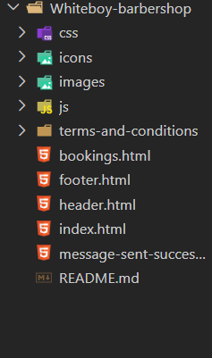

1. Project Title

Corporate Website named: "Stay-Fresh-With Whiteboy" (SFW)

2. Description

A responsive Private website built with HTML5 and CSS3 and JavaScript.
It showcases variety of haircut services and availability for home and Call-out cuts on schedule for anyone in need of a fresh look.

3. Features

• Responsive design (mobile, tablet & desktop friendly)
• Accessible with proper semantic HTML and ARIA labels
• Sticky navigation bar and hamburger menu
• Custom branding and styling

4. Folder structure

5. Technologies Used

- HTML5
- Modern CSS3 (Flexbox, Grid, Media Queries)
- Form Handling API from "Web3Forms" (https://docs.web3forms.com)

-  Palette Color:

:root {
  --blue-theme: #00a0de; 
  --blue: #0755c9;
  --dark-blue: #10264b;
  --light-blue: #eef5ff;
  --white: #ffffff;
  --gray: #667085;
  --light-gray: #f7f9fc;
}

6. Accessibility & Best Practices

This site follows accessibility best practices:

- Semantic HTML tags
- Proper alt attributes for images
- Language attribute set to `en-GB`

7. Deployment

Live Demo : https://armel-nzawou-developer.github.io/International-English-Academy/

8. License

- This project is not an open source but private propeerty of "Stay-Fresh-With Whiteboy" (SFW).
- This project is licensed under SFW's brand.
